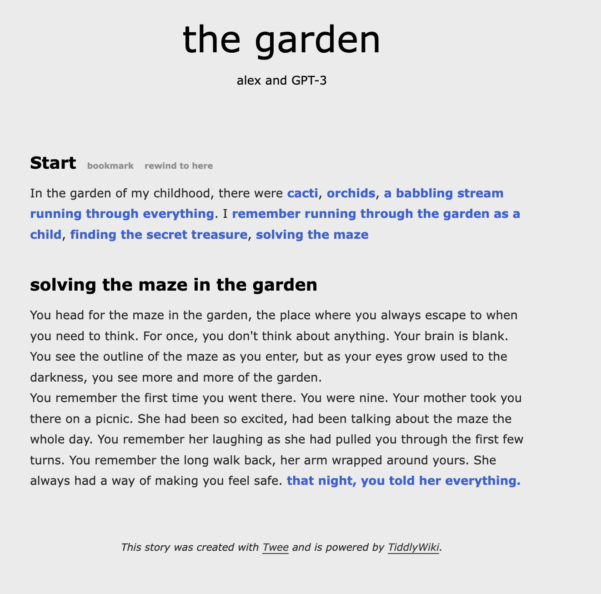

# Spindle - (work in progress)

Spindle is a mixed-initiative tool for writing interactive, branching fiction.

At present, the GPT-3 model I trained is not publicly accessible, but I am working on that. This repo contains all resources needed to collect training data and fine-tune your own model for under $10.

# Setup

You must have Python 3.7 for this project. Optionally, I recommend using a virtual environment like [conda](https://docs.conda.io/projects/conda/en/latest/user-guide/tasks/manage-environments.html) for managing the environments as follows.

    conda create -n spindle python=3.7
    conda activate spindle

Install the python 3 requirements. 

    pip install -r src/requirements.txt
    
Download the largest spacy language model.

    chmod +x src/setup_spacy.sh
    src/setup_spacy.sh
    
Add your OpenAI API Key

Navigate to [https://beta.openai.com/account/api-keys](https://beta.openai.com/account/api-keys). Copy your key and set it as an environment variable.

    export OPENAI_API_KEY=<YOUR_KEY>

# Run interactive twine generation

    python src/spindle.py

# Training

## Collect Training Data

- Twine games from itch.io

    python src/data_collection.py

## Create training data file

- Run through the cells in `src/create_contextual_training_data.ipynb`
- Will create a file that can be uploaded to GPT-3 for fine-tuning

# Run interactive twine generation

    python src/spindle.py

